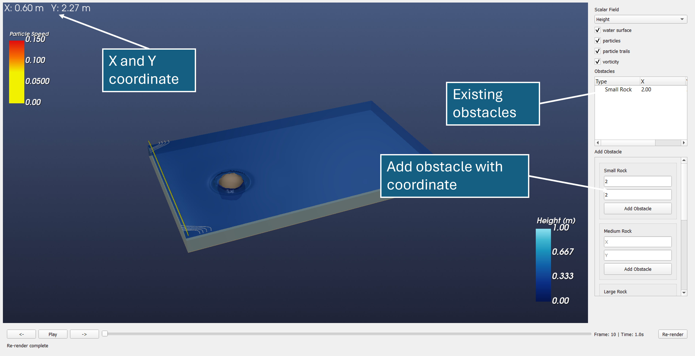

# Interactive Shallow Stream Visualizer

A tool for visualizing shallow water stream flow with interactive obstacle placement and simulation controls.

---

## Running Code
- Python packages in `src/requirements.txt`
- The entry point is `main.py` 

---

## Overview

The visualizer has three main components:

- **Sidebar** — Visualization options and interactive obstacle placement
- **Center Screen** — Main visualization display
- **Bottom Bar** — Timeline and simulation controls

The typical workflow is:
1. Add obstacles using the sidebar
2. Re-render the simulation using the bottom bar
3. Play back the visualization
4. Adjust what is displayed using the sidebar options

> **Note:** After adding or removing obstacles, you must click the **Re-render** button to trigger a re-simulation and get an accurate visualization.

---

## Adding & Removing Obstacles

1. Hover over the water stream in the center screen and note the **x** and **y** coordinates displayed.
2. In the right sidebar, choose one of the five preset obstacle types:
   - Small Rock
   - Medium Rock
   - Large Rock
   - Small Log
   - Large Log
3. Enter the desired **x** and **y** coordinates and click **Add Obstacle**.
4. After a brief processing period, the obstacle will appear in the center visualization and an entry will be added to the right sidebar.

To **remove** an obstacle, double-click its entry in the right sidebar (entries are distinguished by their x and y coordinates).

---

## Simulation Controls (Bottom Bar)

Once obstacles are placed, use the bottom bar to control the simulation:

| Control | Description |
|---|---|
| **Re-render** (bottom right) | Re-runs the simulation to reflect current obstacles |
| **Status Bar** | Shows when the simulation is complete |
| **Start / Pause** | Plays or pauses the simulation |
| **Left / Right Arrows** | Steps the simulation one frame at a time |
| **Time Knob** | Drag to scrub through the timeline (may have a slight delay) |

---

## Visualization Modes

By default, the tool displays **particles**. Additional display options can be toggled using the checkboxes and dropdown in the sidebar:

- **Checkboxes** — Toggle surface, particles, and contours on or off
- **Dropdown** — Enable **LAVD** (Lagrangian-Averaged Vorticity Deviation) visualization